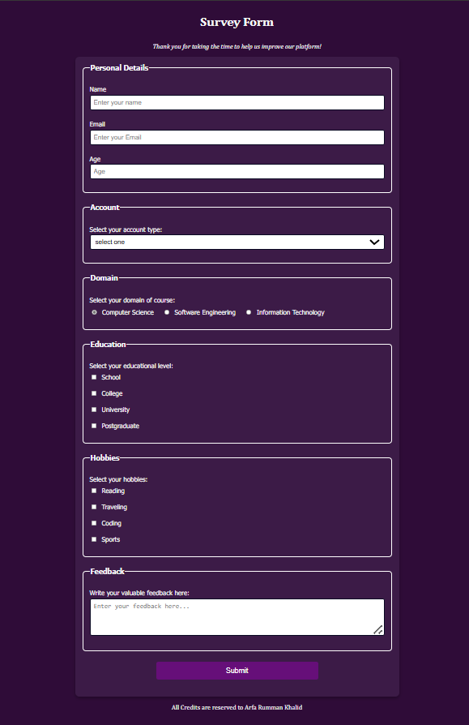
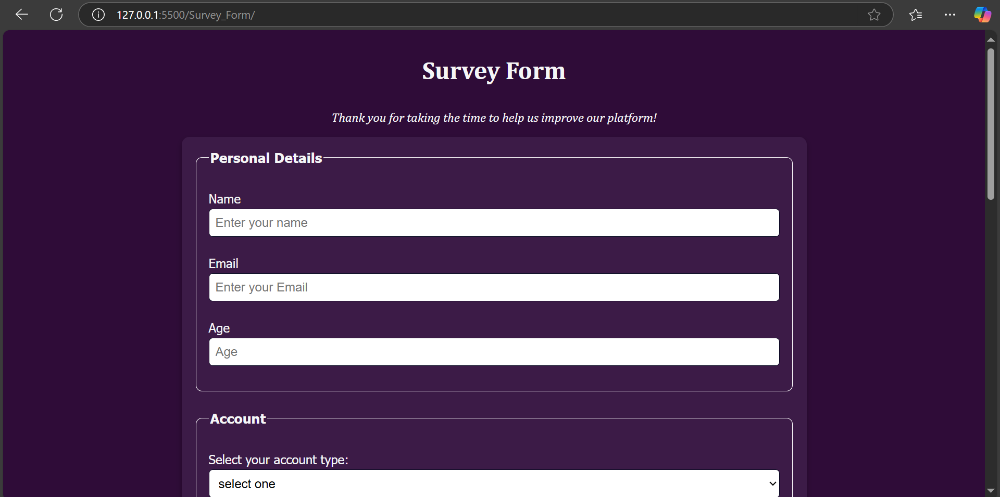
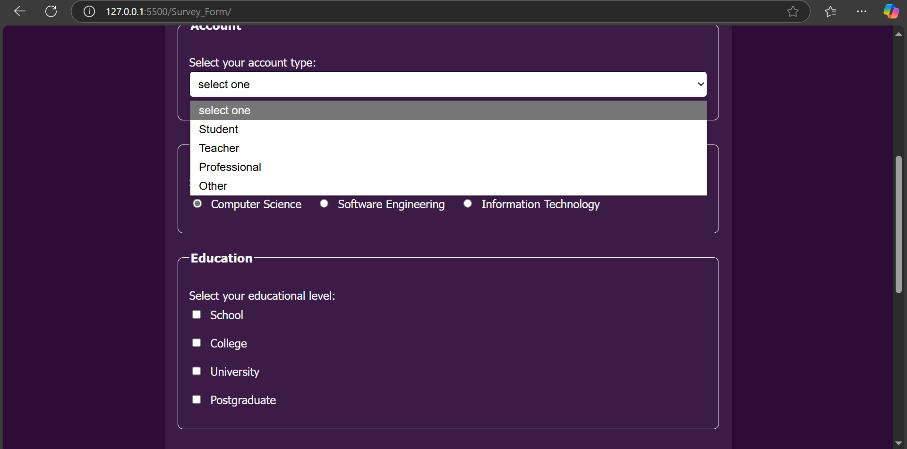
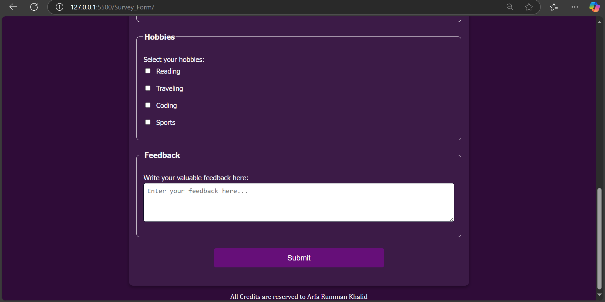

# Survey Form Project

This is a responsive survey form built with HTML and CSS. The form collects user details, account type, domain preferences, education level, hobbies, and feedback.

## Features
- Fully responsive design
- Accessible inputs and controls
- User-friendly layout

## Screenshots

## How to Run
1. Clone the repository: `git clone <repo-link>`
2. Open `index.html` in your web browser.

## License
This project is licensed under the MIT License.
